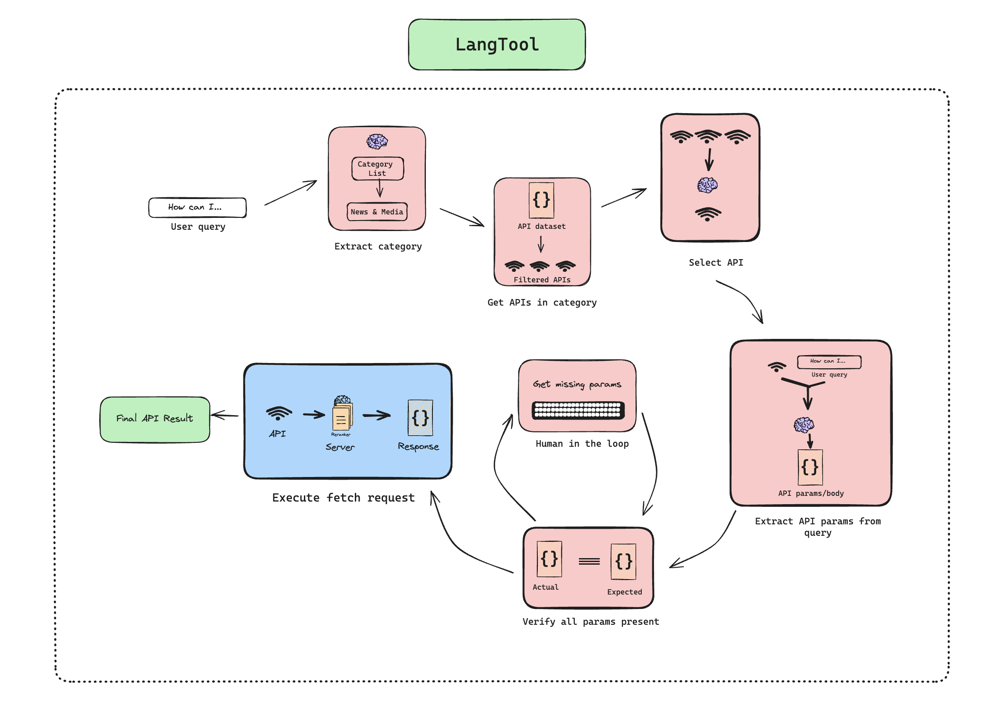

# LangTool

> LangTool is inspired by the Anytool and Toolbench papers. The dataset is also a subset of APIs from the Toolbench dataset.

Interested in the full dataset of ~16,000 APIs? Click [here](https://drive.google.com/drive/folders/1yBUQ732mPu-KclJnuQELEhtKakdXFc3J?usp=sharing) for the Google Drive folder.
